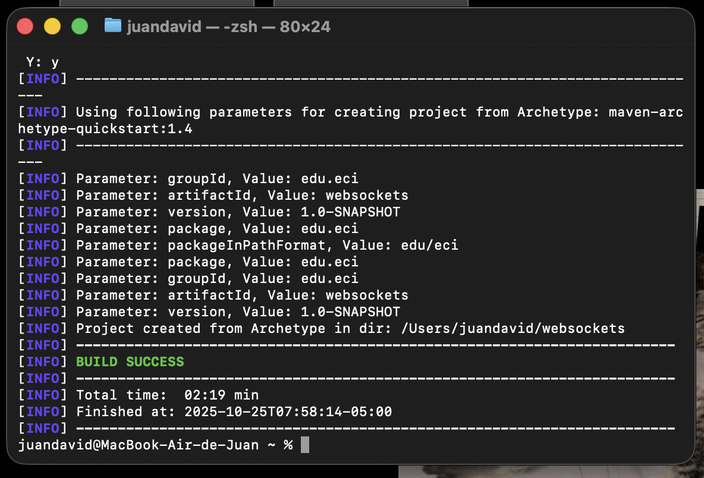

### Escuela Colombiana de Ingeniería
### Arquiecturas de Software

---

### Juan David Zambrano Gonzalez

---

# Tutorial Spring.io, Websockets, ReactJs-18, P5.js,AWS: buenas prácticas de Diseño

> Vamos ahora a construir una aplicación interactiva en tiempo real usando una buena estrategia de diseño. Para esto vamos a construir una aplicación que permite dibujar de manera colaborativa en tiempo real.

> La aplicación soporta múltiples clientes. La comunicación es en tiempo real. 

## Arquitectura

> Queremos construir una aplicación web con comunicación bidirectional entre el
cliente y el servidor. Los clientes inician su dibujo y se puede diferenciar su trazo
del trazo de los clientes remotos.
La arquitectura usará ReactJs del lado del cliente y Spring.io del lado del servidor.
En le taller le mostraremos cómo construir una arquitectura escalable y entendible
usando estos elementos.


## ***1. Crear una aplicación java básica usando maven.***

> mvn archetype:generate -DarchetypeGroupId=org.apache.maven.archetypes -DarchetypeArtifactId=maven-archetype-quickstart -DarchetypeVersion=1.4





## 2. ***Actualizar el pom para utilizar la configuración web-MVC de spring boot.*** 

```xml
<?xml version="1.0" encoding="UTF-8"?>

<project xmlns="http://maven.apache.org/POM/4.0.0" xmlns:xsi="http://www.w3.org/2001/XMLSchema-instance"
  xsi:schemaLocation="http://maven.apache.org/POM/4.0.0 http://maven.apache.org/xsd/maven-4.0.0.xsd">
  <modelVersion>4.0.0</modelVersion>

  <groupId>edu.eci</groupId>
  <artifactId>websockets</artifactId>
  <version>1.0-SNAPSHOT</version>

  <name>websockets</name>
  <!-- FIXME change it to the project's website -->
  <url>http://www.example.com</url>

  <properties>
    <project.build.sourceEncoding>UTF-8</project.build.sourceEncoding>
    <maven.compiler.source>17</maven.compiler.source>
    <maven.compiler.target>17</maven.compiler.target>
  </properties>

  <dependencies>
    <dependency>
      <groupId>junit</groupId>
      <artifactId>junit</artifactId>
      <version>4.11</version>
      <scope>test</scope>
    </dependency>


    <dependency>
      <groupId>org.springframework.boot</groupId>
      <artifactId>spring-boot-starter-web</artifactId>
      <version>3.1.1</version>
    </dependency>

    <dependency>
      <groupId>org.springframework.boot</groupId>
      <artifactId>spring-boot-starter-websocket</artifactId>
      <version>3.1.1</version>
    </dependency>

  </dependencies>

  <build>
      <plugins>

        <plugin>
          <groupId>org.springframework.boot</groupId>
          <artifactId>spring-boot-maven-plugin</artifactId>
        </plugin>

      </plugins>  
  </build>
</project>
```

## 3. ***Cree la siguiente clase que iniciará el servidor de aplicaciones de Spring.***

```java
package edu.eci;

import org.springframework.boot.SpringApplication;
import org.springframework.boot.autoconfigure.SpringBootApplication;
@SpringBootApplication
public class BBAppStarter {
    public static void main(String[] args){
    SpringApplication.run(BBAppStarter.class,args);
    }
}
```

## 4. ***Cree un controlador Web que le permitirá cargar la configuración mínima Web-MVC.***

```java
package edu.eci.controllers;

import org.springframework.web.bind.annotation.RequestMapping;
import org.springframework.web.bind.annotation.RequestMethod;
import org.springframework.web.bind.annotation.RestController;
@RestController
public class DrawingServiceController {
    @RequestMapping(
    value = "/status",
    method = RequestMethod.GET,
    produces = "application/json"
    )
    public String status() {
        return "{\"status\":\"Greetings from Spring Boot. "
        + java.time.LocalDate.now() + ", "
        + java.time.LocalTime.now()
        + ". " + "The server is Runnig!\"}";
    }
}
```

### 1. ***Cree un index html en la siguiente localización: /src/main/resources/static***
### 2. ***Corra la clase que acabamos de crear y su servidor debe iniciar la ejecución***
### 3. ***Verifique que se esté ejecutando accediendo a:***

> ### localhost:8080/status


> ### localhost:8080/index.html


## Ahora construimos el cliente Web

``` html
<!DOCTYPE html>
<html>
    <head>
        <title>Interactive BB</title>
        <meta charset="UTF-8">
        <meta name="viewport" content="width=device-width, initial-scale=1.0">
        <!-- Load P5.js. -->
        <script src="https://cdnjs.cloudflare.com/ajax/libs/p5.js/0.7.1/p5.min.js">
        </script>
        <script
        src="https://cdnjs.cloudflare.com/ajax/libs/p5.js/0.7.1/addons/p5.dom.min.js">
        </script>
        <script
        src="https://cdnjs.cloudflare.com/ajax/libs/p5.js/0.7.1/addons/p5.sound.min.js">
        </script>
    </head>
    <body>
        <div id="root"></div>
        <h1>Interactive BlackBoard</h1>
        <!-- Load React. -->
        <!-- Note: when deploying, replace "development.js" with "production.min.js". -->
        <script src="https://unpkg.com/react@18/umd/react.development.js" crossorigin>
        </script>
        <script src="https://unpkg.com/react-dom@18/umd/react-dom.development.js"
        crossorigin></script>
        <!-- Load babel to translate JSX to js. -->
        <script src="https://unpkg.com/babel-standalone@6/babel.min.js"></script>
        <!-- Load our React component. -->
    </body>
</html>
```

## Construyamos el componente ReactJS paso a paso.

``` jsx
const root = ReactDOM.createRoot(document.getElementById("root"));

// Retorna la url del servicio. Es una función de configuración.
function BBServiceURL() {
var host = window.location.host;
console.log("Host: " + host);
// En heroku necesita conexiones seguras de web socket
var url = 'wss://' + (host) + '/bbService';
if(host.toString().startsWith("localhost")){
url = 'ws://' + (host) + '/bbService';
}
console.log("URL Calculada: " + url);
return url;
}

class WSBBChannel {
  constructor(URL, callback) {
    this.URL = URL;
    this.wsocket = new WebSocket(URL);
    this.wsocket.onopen = (evt) => this.onOpen(evt);
    this.wsocket.onmessage = (evt) => this.onMessage(evt);
    this.wsocket.onerror = (evt) => this.onError(evt);
    this.receivef = callback;
  }

  onOpen(evt) { console.log("WS open", evt); }
  onMessage(evt) {
    if (evt.data != "Connection established.") {
      this.receivef(evt.data);
    }
  }
  onError(evt) { console.error("WS error", evt); }
  send(x, y) {
    let msg = '{ "x": ' + (x) + ', "y": ' + (y) + "}";
    this.wsocket.send(msg);
  }
  close() { this.wsocket.close(); }
}

function BBCanvas() {
  const [svrStatus, setSvrStatus] = React.useState({loadingState: 'Loading Canvas...'});
  const comunicationWS = React.useRef(null);
  const myp5 = React.useRef(null);

  const sketch = function (p) {
    p.setup = function () {
      p.createCanvas(700, 410);
    }

    p.draw = function () {
      if (p.mouseIsPressed === true) {
        p.fill(0, 0, 0);
        p.ellipse(p.mouseX, p.mouseY, 20, 20);
        if (comunicationWS.current) comunicationWS.current.send(p.mouseX, p.mouseY);
      } else {
        p.fill(255, 255, 255);
      }
    }
  };

  React.useEffect(() => {
    myp5.current = new p5(sketch, 'container');
    setSvrStatus({loadingState: 'Canvas Loaded'});
    comunicationWS.current = new WSBBChannel(BBServiceURL(), (msg) => {
      var obj = JSON.parse(msg);
      drawPoint(obj.x, obj.y);
    });
    return () => {
      if (comunicationWS.current) comunicationWS.current.close();
    };
  }, []);

  function drawPoint(x, y) {
    myp5.current.ellipse(x, y, 20, 20);
  }

  return (
    <div>
      <h4>Drawing status: {svrStatus.loadingState}</h4>
      <div id="container"></div>
    </div>
  );
}

function Editor({name}) {
  return (
    <div>
      <h1>Hello, {name}</h1>
      <hr/>
      <div id="toolstatus"></div>
      <hr/>
      <div id="container"><BBCanvas /></div>
      <hr/>
      <div id="info"></div>
    </div>
  );
}

root.render(<Editor name="Daniel" />);

```

## Corra su aplicación desde la línea de comandos

> java -cp target/classes:target/dependency/*co.edu.escuelaing.interactiveblackboard.BBAppStarter


## Instancia de AWS


Ingresamos a la instancia


Ejecutamos
> sudo dnf update -y


> sudo dnf install -y java-17-amazon-corretto git nginx

Y verificamos

> java -version


